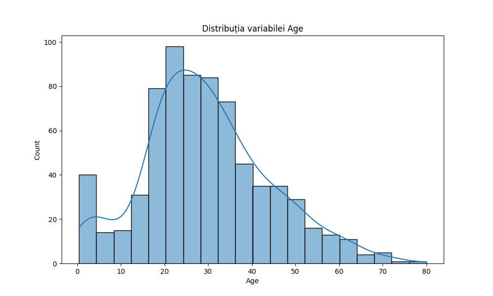

Gheorghe Rares-Mihail, 311CA

Partea 2

    La inceput, pentru Age si Fare, imi creez doua grafice pentru a reprezenta
distributia inainte de eliminari. Folosesc histplot() pentru a face o histograma.
Imi declar vectorul coloane, care contine campurile 'Age' si 'Fare'.
    1) Age:
    2) Fare: 

    Pentru cerinta 1, calculez Q1 si Q3 folosind functia quantile(). Apoi
calculez diferenta lor, ce reprezinta IQR. Apoi, imi retin doar valorile care
sunt in intervalul [val_jos, val_sus], pe care calculez dupa formulele din cerinta.
Retin noul set de date intr-un fisier numit modificat.csv si creez doua 
noi grafice pentru a vedea noile distributii.
    1) Age: 
    2) Fare: 
    3) modificat.csv

    Pentru cerinta 2, retin initial indicii care au valorea TRUE, folosind ones().
Apoi, pentru coloanele Age si Fare, calculez z-score-ul folosind functia z-score(),
pentru toate elementele care sunt diferite de NaN. Dupa aceea, caluclez valoarea in
modul ale acestor scoruri, iar daca z-score-ul este mai mic decat eroarea, pun true.
    1) Z-score Age: 
    2) Z-score Fare: 

    Pentru cerinta 4, scriu functia data, care in prima faza,scoate din df
coloanele Name ticket si cabin(folosesc drop()), retin in imp o completare 
a vectorului, unde elementele care nu sunt numere sunt inlocuite cu media 
vectorului.(folosesc SimpleImuter() cu argumentul 'mean') 
Apoi, transformam coloanele Sex si Embarked in valori numerice, din forma text.
(folosesc LabelEncoder())
Dupa aceea, coloanele sunt normalizate folosind StanndardScaler.
    Apoi, impart setul de date in doua si aplic functia data pe cele doua
seturi, pentru a le preporcesa. Imi retin datele, unele care nu contin coloana
'Survived' si unele care contin doar coloana 'Survived'.
    Aplic algoritmul Random Forest pentru a antrena setul de date
(RandomForestClassifier), pe ca il aplic pe x_trainm si y_train.
In y_pred retin predictiile.
    Folosesc functia accuracy_score pentru a calcula acuratetea, comparand
datele adevarate si cele prezise.
    Folosesc functia confusion_matrix pentru a arata numarul de predictii
corecte si gresite(true positives, false positives, true negatives, false 
negatives).
    La final fac si un heatmap pentru acestea.
    1) heatmap: 
    2) acuratete: Acuratetea este: 0.8278688524590164
    3) confusion matrix:
        Confusion Matrix:
        [[76 11]
        [10 25]]